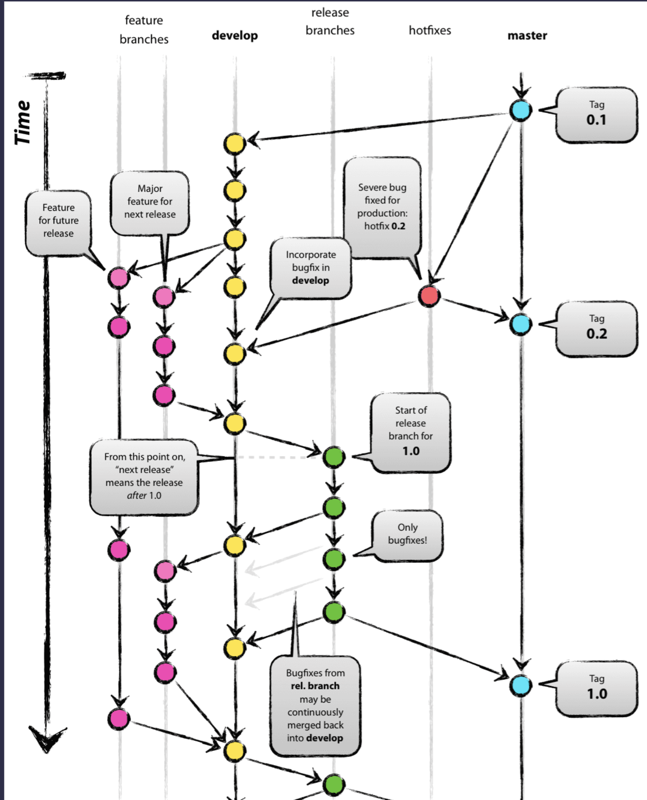

# RECAP GIORNO 4: Architettura del Codice, Git e Git Flow

L'obiettivo di oggi non era scrivere nuovo codice, ma imparare a proteggerlo. Abbiamo abbandonato l'approccio amatoriale e abbracciato lo standard industriale: il Version Control System. Niente mouse, niente interfacce grafiche. Solo terminale e nuda verità. Chi usa il mouse per Git oggi, non capirà mai come risolvere i conflitti domani.

---

## 1. Il Modello Mentale (Le Tre Aree)

Dimenticate Google Drive. Dimenticate i file chiamati `progetto_finale_v3_VERO.py`. Git non è un sistema di backup, è un registro contabile immutabile del vostro codice (un Grafo). Un senior non perde mai un file. Git divide il vostro spazio di lavoro in tre zone isolate:

1. **Working Directory (Il Tavolo di Lavoro):** Dove scrivete il codice. Se i file sono qui e il PC si spegne, li perdete.
2. **Staging Area (La Scatola di Spedizione):** Dove mettete i file pronti per essere salvati. È la sala d'attesa.
3. **Repository (La Cassaforte):** L'archivio permanente. Una volta che un file è qui dentro, ha un codice crittografico univoco (Hash) e non può essere cancellato per sbaglio.

---

## 2. Esecuzione Locale e Sintassi Cruda

- **`git init`**
  Questo comando inietta un database nascosto (`.git`) nella cartella. Da questo millisecondo, tutto è tracciato. Se cancellate quella cartella nascosta, distruggete l'intera storia del progetto
- **`git status`**
  È il vostro radar. Usatelo compulsivamente. Se un file è rosso (Untracked), è sul tavolo di lavoro ma Git lo sta ignorando
- **`git add <nome_file>`** (es. `git add main.py`)
  Il file diventa verde. Lo abbiamo spostato nella Staging Area. Lo abbiamo messo nella scatola, ma non è ancora nella cassaforte
- **`git commit -m "feat: setup iniziale del progetto"`**
  Il Commit è il sigillo e il messaggio deve spiegare il _'perché'_ della modifica. Scrivere 'fix' o 'aggiornamento' è motivo di bocciatura automatica della vostra Pull Request

---

## 3. Il Git Graph (L'Albero della Verità)

Git non è una cartella di backup, è un Grafo. Ogni commit è un nodo, collegato al commit precedente. Questo crea una catena del tempo inalterabile.

**Il comando radar dei Senior:** `git log --graph --oneline --all`

Questo comando è la vostra vista a raggi X. Vi fa vedere esattamente come si ramifica il codice nel tempo. Vedrete l'hash (es. `a1b2c3d`), che è la targa del vostro commit, e un puntatore speciale chiamato `HEAD`. `HEAD` è semplicemente il punto esatto in cui vi trovate a guardare il codice in questo istante. Se non sapete dove punta `HEAD`, state programmando alla cieca

---

## 4. Branching

Lavorare direttamente sul branch `main` è come fare un intervento a cuore aperto bendati in mezzo alla strada. Il `main` è sacro. È il codice che gira sui server dei clienti e le nuove funzionalità si sviluppano in stanze isolate chiamate Branch.

1. **L'Isolamento (`git checkout -b feature/login`)**
   - Il comando `checkout` è il vostro teletrasporto. Sposta il puntatore `HEAD` dove volete voi. Il flag `-b` sta per 'Branch'. Crea un nuovo ramo e vi ci teletrasporta dentro istantaneamente. Avete appena clonato la realtà: siete su un ramo temporale parallelo. Fate i danni che volete qui, il `main` è intoccabile.
2. **Lo Sviluppo Parallelo**
   - Modificate i file, fate `git add .` e `git commit -m "..."`. Se rilanciate il comando del Grafo, vedrete che `HEAD` si è spostato. Il vostro branch è andato avanti nel tempo, ma il `main` è rimasto indietro, stabile e sicuro.
3. **Il Merge / L'Integrazione (`git merge feature/login`)**
   - Il lavoro funziona, dobbiamo portarlo in produzione. **Regola spietata del Merge:** dovete sempre posizionarvi fisicamente nella stanza in cui volete far entrare i dati.
   - Prima torniamo nel passato stabile: `git checkout main`
   - Poi tiriamo dentro il futuro: `git merge feature/login`. Il codice è fuso, pronti per il cloud

---

## 5. Il Ponte verso il Cloud

- **`git remote add origin <URL_GITHUB>`**
  - Il vostro PC non parla con Internet di default. Con `remote add` tiriamo un cavo di rete immaginario tra la vostra cartella e i server. Ricrodate che `origin` non fa parte del un comando ma è solo una variabile, il soprannome standard che diamo a questo URL esterno
- **`git push -u origin main`**
  - Prendi i commit e sparali sulla nuvola. A cosa serve `-u`? Sta per `--set-upstream`. La prima volta, il PC e GitHub non sanno di essere sincronizzati. Il flag `-u` costruisce un binario permanente tra il vostro `main` locale e il `main` su `origin`. Dal prossimo push, vi basterà digitare `git push` da solo

---

## 6. L'Ingegneria dei Rilasci: Il Git Flow

Nelle aziende strutturate non si usano solo due branch. Si utilizza una strategia rigorosa per separare il codice in lavorazione dalle emergenze in produzione. Il pattern più famoso è il **Git Flow**

Analizziamo l'anatomia di questo flusso:

- **`master` (o `main`) [Pallini Azzurri]:** La linea della verità. Questo codice è in produzione. Ogni commit su questa linea corrisponde a una release ufficiale taggata (es. v1.0, v2.0).
  **⚠️ REGOLA AZIENDALE ASSOLUTA:** Nessuno, nemmeno il Senior Architect, esegue mai un `git push` diretto su `main` o `master`. Nelle repository professionali, questi branch sono bloccati tramite _Branch Protection Rules_. L'unico modo per iniettare codice qui dentro è aprire una **Pull Request (PR)**, ottenere l'approvazione (Code Review) da almeno un altro sviluppatore e avere il semaforo verde dalla pipeline automatizzata dei test. Chi forza un push in produzione sta distruggendo il Quality Gate
- **`dev` [Pallini Gialli]:** Il cantiere principale. Contiene il codice in pre-produzione. Quando le feature sono finite, convergono tutte in questa linea per essere testate insieme. Anche questo branch è solitamente protetto da push diretti.
- **`feature branches` [Pallini Rosa]:** Le vostre stanze private. Si staccano da `develop` e, una volta finita la nuova funzionalità, si fondono (merge tramite Pull Request) di nuovo in `develop`.
- **`release branches` [Pallini Verdi]:** Quando `develop` ha abbastanza feature per una nuova versione, si stacca un ramo `release`. Qui non si aggiungono nuove funzionalità, si sistemano solo gli ultimi bug (fase di collaudo). Finito il collaudo, viene fuso sia in `master` (per andare live) sia in `develop`.
- **`hotfixes` [Pallini Rossi]:** L'ambulanza. Se scoppia un bug critico in produzione (su `master`), non possiamo aspettare la release successiva. Si stacca un branch di hotfix direttamente dal `master`, si corregge l'errore, e si fonde immediatamente sia in `master` che in `develop`
